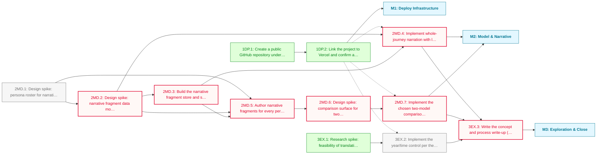

# Reach PHASE_1 Roadmap

The Svelte 5 / SvelteKit 2 port of `reach-of-surrentum.jsx` is complete, tested and themed. This phase deepens the toy itself: continuous publishing infrastructure, situated prose narration with a fallback ladder, a persona-vs-persona comparison surface and a look at whether the seasonal model can honestly support continuous time, closing with a write-up.

**Critical path:** `2MD.1 → 2MD.2 → 2MD.3 → 2MD.5 → 2MD.6 → 2MD.7`; the persona roster and fragment-model spikes gate everything narrative, and full-coverage authoring must land before comparison is meaningful.

---

## Milestone 1: Deploy Infrastructure

**Goal:** every later task can ship the moment it's done, not batch at the end.

- [x] **1DP.1**: Create a public GitHub repository under JasonWarrenUK and push the existing local history
- [x] **1DP.2**: Link the project to Vercel and confirm a production deploy from main

---

## Milestone 2: Model & Narrative

**Goal:** the routing model gains legible depth, and journeys narrate themselves in prose that degrades gracefully from hand-written to generated.

- [ ] **2MD.1**: Design spike: persona roster for narrative authoring (which personas ship, whether the existing villa/fisher/tenant set is right or changes)
  - Note: output is a written recommendation for approval: keep, extend or revise the current three-persona roster (villa household, fishing family, tenant farmer) specifically for narrative-authoring purposes. Hard constraint carried forward into every downstream task: the tool must never ship in a state where only one persona has narrative content, since single-persona coverage defeats the comparison feature's purpose. This spike's roster is binding on 2MD.5 onward.
- [ ] **2MD.2**: Design spike: narrative fragment data model and specificity-ladder selection algorithm _(blocked: depends on 2MD.1)_
  - Note: decides the fragment schema across the authored-to-generated continuum (exact persona+season+vehicle+location, down through interstitial combinations, to deterministic stitched generic prose), the tie-break rule when two fragments are equally specific along different dimensions, and whether leg-level drill-down is a separate reading surface or an inline expand/collapse of the whole-journey text. Season key: per the approved 3EX.1 spike ([`docs/spikes/3ex1-year-control.md`](../spikes/3ex1-year-control.md)), `SeasonKey` stays three-valued (sailing, shoulder, winter) and a four-segment calendar layer (spring, sailing, autumn, winter) maps onto it. Key fragments on `SeasonKey`; treat the segment as an optional, more specific rung on the ladder.
- [ ] **2MD.3**: Build the narrative fragment store and specificity-ladder selector _(blocked: depends on 2MD.2)_
- [ ] **2MD.4**: Implement whole-journey narration with leg-level drill-down per the spike's chosen UI model _(blocked: depends on 2MD.2, 2MD.3)_
- [ ] **2MD.5**: Author narrative fragments for every persona in the confirmed roster, to at least the deterministic-stitched floor _(blocked: depends on 2MD.1, 2MD.2, 2MD.3)_
  - Note: the floor obligation, not a stretch goal. Every persona in the 2MD.1 roster needs at minimum the deterministic-stitched-generic tier working before this counts done; hand-authored exact-match fragments for any given persona are additive on top, never a substitute for another persona having nothing.
- [ ] **2MD.6**: Design spike: comparison surface for two full models (overlay, delta readout or difference-as-projection) _(blocked: depends on 2MD.5)_
  - Note: output is a written recommendation for approval. Candidates: a ghost chart overlaying two coastline-clipped isochrone sets; a delta readout ("the tenant reaches 11 fewer places; Rome moves from sphere 4 to sphere 5"); or the difference itself as the chart's projection. Blocked on the persona roster and full-coverage floor because comparing two models is meaningless if either side has no narrative content.
- [ ] **2MD.7**: Implement the chosen two-model comparison surface _(blocked: depends on 2MD.6)_

---

## Milestone 3: Exploration & Close

**Goal:** test whether the model can honestly support continuous time, then close the phase with the concept write-up.

- [x] **3EX.1**: Research spike: feasibility of translating the seasonal model into a continuous year control
  - Note: outcome: stepped control approved 2026-09-17, see [`docs/spikes/3ex1-year-control.md`](../spikes/3ex1-year-control.md). Original brief: `SEASONS[season].forbid` is a discrete closed-mode list and `returnFactorAt` has no time term; true continuity needs either dated closures and a seasonal wind curve, or an honest admission that a stepped control snapped to real Roman calendar moments (sailing season opening, harvest, mare clausum) is the defensible option. A recommendation against full continuity, in favour of the stepped version, is an acceptable spike outcome. Output: a written recommendation for approval.
- [ ] **3EX.2**: Implement the year/time control per the spike's recommendation
  - Note: per [`docs/spikes/3ex1-year-control.md`](../spikes/3ex1-year-control.md) (approved 2026-09-17): a `YearBand` control with four segments bounded by Vegetius 4.39 (10 March, 27 May, 14 September, 11 November), widths proportional to day counts, band starting at 10 March. `SeasonKey` stays three-valued; segments map onto it. Hash param `s` takes `spring`, `sailing`, `autumn`, `winter`, with legacy `shoulder` read as `spring`; `readHash` (`src/lib/hash-state.ts:29`) must validate `s` against the segment table, since `SEASONS` has no `spring` or `autumn` key, and the page derives `SeasonKey` from the segment. No time term on `returnFactorAt`, no harvest marks, no day-level scrubbing.
- [ ] **3EX.3**: Write the concept and process write-up (the historical argument and the build story, one document) _(blocked: depends on 2MD.4, 2MD.7, 3EX.2)_
  - Note: covers both what the toy is arguing about antiquity and what building it involved, combining devlog and concept framing in one document. Depends on the M2 and M3 implementation tasks finishing first: the build story can't be written until the build is done.

---

## Dependency Diagram

