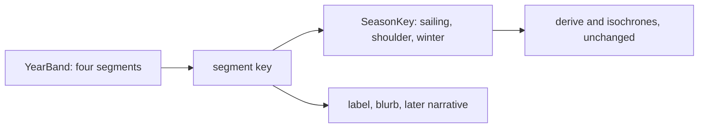

# Spike 3EX.1: Year Control Feasibility

| Prop     | Value |
|----------|-------|
| Status   | Approved 2026-09-17 |
| Date     | 2026-09-17 |
| Task     | 3EX.1 |
| Unblocks | 3EX.2 |

## Recommendation

Build a stepped year control with four segments, bounded by the four dates in Vegetius 4.39 and drawn as a band in which each segment's width is its real share of the year. Keep the routing model's three states as they are. Drop the continuous control.

## What the model does with a season today

Season reaches the routing in three places. Each is a set-membership test or a literal comparison:

- `src/lib/routing/dijkstra.ts:33` closes an edge when `SEASONS[season].forbid` includes its mode
- `src/lib/routing/coarse-cost.ts:71` does the same for points beyond the network
- `src/lib/geometry/projection.ts:116` returns no isochrones at all in winter

Nothing scales with season: pace, waits and comfort weights ignore it; `returnFactorAt(lon, lat)` takes a position and nothing else.

I ran `derive()` for every preset traveller in every season and counted the places with an open route (30 places in total):

| Traveller | Sailing | Shoulder | Winter |
|-----------|---------|----------|--------|
| Villa household | 30 | 24 | 22 |
| Fishing family  | 30 | 24 | 22 |
| Tenant          | 24 | 24 | 22 |

Moving from sailing to shoulder shuts six places for the villa household and the fishing family (Carthago, Alexandria, Corinthus, Ephesus, Massilia, Gades) and changes no other travel time by so much as a hundredth of a day. The tenant never boards a ship, so their sailing and shoulder charts are identical. Shoulder to winter changes 21 of 30 places for the villa household and 11 for the tenant.

The return factor differs between outward and homeward journeys for seven places in the sailing season, two in the shoulder months (Ostia and Roma, by coaster) and none in winter.

So the chart has three possible states for two travellers and two for the third. A continuous dial would have 365 positions and at most three outcomes.

## Why continuity fails

The existing season blurbs are already Vegetius' calendar with spring and autumn merged. His chapter on sailing months (*Epitoma rei militaris* 4.39) gives:

| Latin | Date | What he says |
|-------|------|--------------|
| `a die VI. kal. Iunias` | 27 May | secure sailing begins, after the rising of the Pleiades |
| `in diem VIII. decimum kal. Octobres` | 14 September | secure sailing ends, at the rising of Arcturus |
| `usque in tertium idus Nouembres` | 11 November | the doubtful autumn stretch ends |
| `ex die tertio idus Nouembres usque in diem sextum idus Martias maria clauduntur` | 11 November to 10 March | the seas are shut |
| `usque in idus Maias periculose maria temptantur` | to 15 May | after the "birthday of navigation", the seas are tried at some danger |

(Roman dates count inclusively backwards from the Kalends or Ides; the conversions above are mine.)

A continuous control needs a quantity that varies by the day. There are two ways to get one. Dated closures are the first, and dated closures are a stepped control by another name. The second is a curve: a weather wait or a sea pace that rises and falls with the date. Vegetius gives boundaries and adjectives (secure, doubtful, dangerous, shut); he gives no rates, and I found no ancient source that does. Any curve between 10 March and 27 May would be my invention. The chart would draw one coastline for 3 April and a slightly different one for 4 April with no text behind either.

That breaks a rule the project already keeps. `src/lib/data/sources.ts` cites a text for every place or says plainly "No ancient text"; an interpolated wind curve has no honest entry to write there.

Speed doesn't settle it either way. A full recompute, measured over 30 runs in Node:

| Stage | ms |
|-------|----|
| `derive()` (five Dijkstra runs) | 0.6 |
| `isochrones()`, fine and coarse together | 7.9 |
| `projectCoast()`, fine and coarse together | 12.5 |

The page only ever computes one zoom family at a time, so the real figure sits under 21 ms. A live scrubber would run comfortably. The reason to refuse it is evidential.

## The objection to stepping

Vegetius wrote a military manual in the late fourth or early fifth century; the toy's world is a first-century villa coast (Statius, the two Plinys). His chapter ends by saying warfleets need more caution than private merchantmen, which concedes that traders sailed outside his dates. Wikipedia's *mare clausum* article says bans on winter navigation "were probably never enforced". Four hard edges on a dial are sharper than practice ever was.

Fuzziness with no numbers attached can't be drawn, but it can be attributed. The control labels each segment in Vegetius' own terms and the blurb names him, so the dates read as one late writer's scheme for a fleet. 3EX.3 can carry the longer argument.

## Proposed design for 3EX.2

### Segments

| Segment | Dates | Days | Vegetius | Model state |
|---------|-------|------|----------|-------------|
| Spring shoulder | 10 March to 27 May | 78 | dangerous until 15 May | `shoulder` |
| Sailing season  | 27 May to 14 September | 110 | secure | `sailing` |
| Autumn shoulder | 14 September to 11 November | 58 | doubtful | `shoulder` |
| Winter          | 11 November to 10 March | 119 | shut | `winter` |

The sea is shut for more days than it is fully open: 119 against 110. Three equal-width buttons hide that; a proportional band shows it before the user clicks anything.

### Layering

`SeasonKey` stays three-valued. The literal comparisons at `projection.ts:116`, `+page.svelte:355`, `+page.svelte:361` and `Reading.svelte:37-39` survive untouched, as do the existing routing tests. The segment is a presentation layer that maps four keys onto three.

### Control

A `YearBand` component replaces the "Time of year" `Choice`. Four buttons in a row, each with `flex-grow` set to its day count, `aria-pressed` as `Choice` does it, arrow keys stepping between segments and wrapping. The band starts at 10 March so that winter is one block and the year opens where Vegetius' navigation year opens.

### Hash state

The `s` parameter currently holds `sailing`, `shoulder` or `winter`. It moves to `spring`, `sailing`, `autumn`, `winter`, with `shoulder` still accepted on read and treated as `spring`. Every link shared so far keeps working.

### Spring against autumn

The two shoulders produce identical model output in 3EX.2. The Etesians blow from about mid-May to mid-September, so the steep eastern ramp in `returnFactorAt` is a sailing-season effect, and open-sea ships are closed in both shoulders anyway. I have nothing sourced that would make the model treat them differently. They differ in label and blurb now, and in narrative later.

## Out of scope for 3EX.2

- **A time term on `returnFactorAt`.** Under the current closures its only effect would fall on coaster returns from Ostia and Roma in the shoulder months. The repo has no month-by-month wind source for the Tyrrhenian.
- **Harvest and vintage marks.** The model has no land-side seasonal term, so these would be annotation only. Each needs a dated source. The rustic calendars (*Menologia Rustica*) are the obvious place to look; I haven't checked them. This belongs with the narrative work.
- **Day-level scrubbing**, for the reasons above.

## Knock-on for 2MD.2

The fragment schema keys on season. Under this layering, fragments key on `SeasonKey`; the segment becomes an optional, more specific rung on the ladder (spring prose against autumn prose for the same model state). 2MD.2 doesn't depend on 3EX.1 in the roadmap; a note on 2MD.2 pointing here would stop the two spikes choosing incompatible keys.

## Verification

| Claim | Checked against | Status |
|-------|-----------------|--------|
| Vegetius' five dates | Latin text, [la.wikisource, Liber IV](https://la.wikisource.org/wiki/Epitoma_rei_militaris/Liber_IV) | Latin quoted; conversions mine |
| Warfleets need more caution than merchantmen | same page | read through a model summary of the Latin; not quoted |
| *Navigium Isidis* on 5 March | [Wikipedia](https://en.wikipedia.org/wiki/Navigium_Isidis) | date confirmed; its identity with Vegetius' "birthday of navigation" not checked, so the design doesn't use it |
| Etesians, mid-May to mid-September | [Wikipedia](https://en.wikipedia.org/wiki/Etesian) | confirmed |
| Bans "probably never enforced" | [Wikipedia](https://en.wikipedia.org/wiki/Mare_clausum) | confirmed; the article cites no ancient source for it |
| Beresford, *The Ancient Sailing Season* (2013) | nothing | web search failed mid-session; his argument is not relied on anywhere above and should be read before 3EX.3 cites him |
| Codex Theodosianus 13.9.3 | nothing | same; not relied on |
| Season counts, return-factor counts, timings | a scratch Vitest harness over `derive()`, `isochrones()` and `projectCoast()`, deleted after the run | measured 2026-09-17 |

## Effort for 3EX.2

Roughly half a day, by my estimate: the segment data and mapping (about 30 lines), the `YearBand` component (about 60), the hash-state alias (about 10) and tests for the segment-to-season mapping and the legacy `shoulder` link.

## Decisions

Approved by Jason on 2026-09-17:

1. Stepped over continuous.
2. The band starts at 10 March, with winter as one block.
3. 2MD.2 carries a note in the roadmap pointing here.
